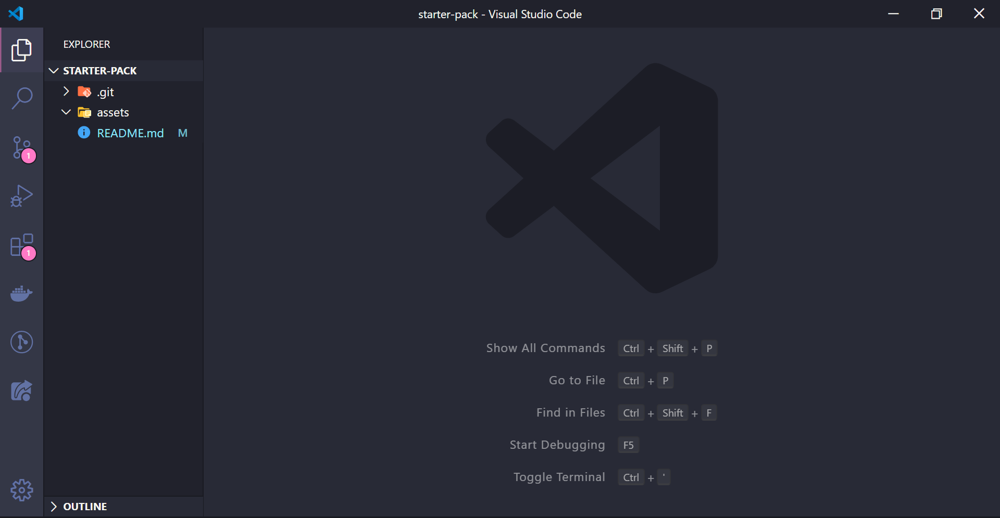
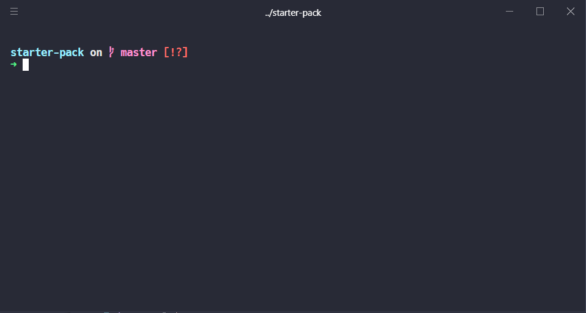
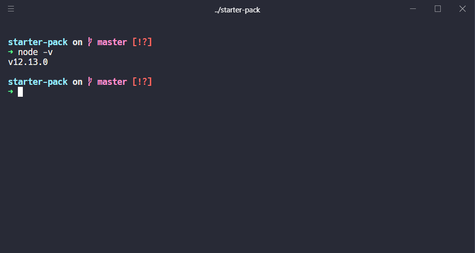

# Starter-pack

### Motivation 

This repository has been designed for those who are starting in code life and have no idea where to start - I can see myself in the past right now.

Note: 

> I used to work as __web developer__, and I really do care for things that make my life __easier__ and my work __greater__, along with my ___experince___ as user and my ___interface___ as developer.

### Who I am

First off all, as you can see in my github, my name is Vinicius and I have worked as software developer in Brazil. It's easy to remember the day that I started coding, something like a year ago.

Along with an introduction to logic and algorithmic thinking, I started to study web development inside a startup - the place where I learned the basics that I will write in here.

This knowledge is not so basic as it might look for people who already do code.

### What you will find here

I will show in here things that I needed to have as ___web developer___ working with nodeJS, ReactJS, JS, PHP, ...

- Text editor and some cool stuff 4 it

- Softwares
  - nodeJS (and npm)
  - git

- WSL (optional)

So, let's start it

You can thank me later for showing [this song](https://www.youtube.com/watch?v=GVp-UOEur6Y) to you while you read this...


## Text Editor (IDE)

  Text editor is something that really matters for me, since that it helps me a lot with my day-by-day work.

  My favourite IDE is __Visual Studio Code__ (VSCode), and it looks like this:

  

  [Download VSCode](https://code.visualstudio.com/download)

  As you can see, I prefer darker themes, and currently I'm using Dracula - best theme ever coff coff coff

  ### Extensions

  You can have Dracula theme - and many other extensions - by going through left side bar in VSCode and clicking in "Extensions". Then, search for __"Dracula Official"__ and install it.

  Some cool extensions for:

  - VSCode

    - Material Icon Theme - Icon Library
    - Dracula Official - Theme Library
    - Live Share - real-time collaborative development

  - HTML development
    
    - Auto close tag
    - Auto complete tag
    - Auto rename tag

  Ok, now that we have our really cool IDE, let's install more things up

## NodeJS

  [Download NodeJS](https://nodejs.org/en/download/)

  By it's words: 

  > _"Node.js® is a JavaScript runtime built on Chrome's V8 JavaScript engine."_
  JS, node.

  Well, in other words, you can run JavaScript outside your browser (Google Chrome, Firefox, ...)

  NodeJS is an extremely powerfull tool, since we can code our backend and our frontend with the _same language_.

  Videos explaining NodeJS while you download it
  - [pt-br](https://www.youtube.com/watch?v=nfrVPzDJZQc)
  - [en-us](https://www.youtube.com/watch?v=uVwtVBpw7RQ)

  Follow the steps for installing it, then, to check if it's working, do the following steps:

  1. Open your terminal (btw mine is [Hyper](https://hyper.is/))

  

  2. type: 

  ```bash
  $ node -v
  ```

  And is expected to see the result as v____ => actual version of your NodeJS

  

## Git

  [Download Git](https://git-scm.com/downloads)

  Git is a distributed versioning tool to keep control of your code.

  Imagine that you are in a team with another person. It's very important that you and your teammate have others features. 

  [More about git](https://medium.com/@onejohi/git-understanding-the-basics-ba004a20dacc), because it's a more complex tool in matter of understanding, and there are people that can do it better than me.


